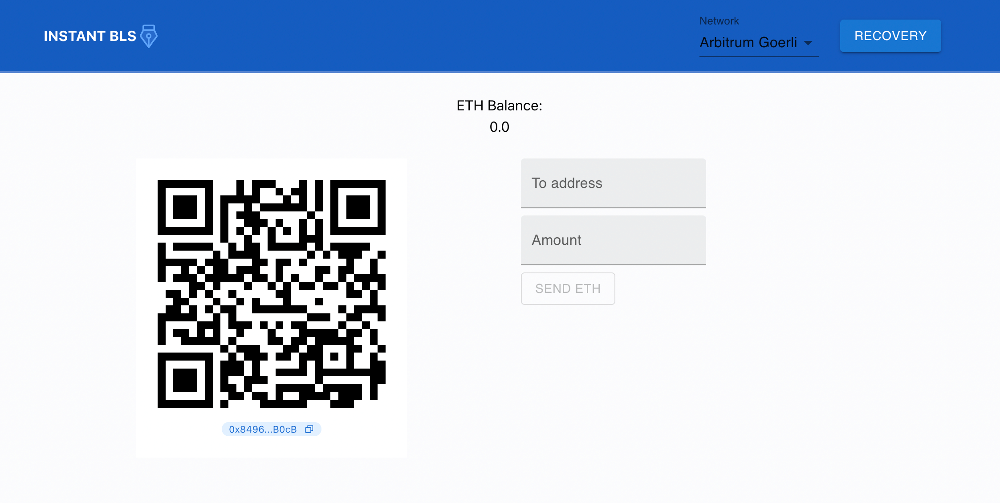

# INSTANT BLS

https://instant.blswallet.org

An opensource simple Ethereum burner wallet that uses BLS signature aggregation.
**Important:** This wallet is currently only meant for demoing the uses of the bls-wallet-client module
and is not meant for mainnet use.

## Local development setup

**BLS Wallet**

Check out the [bls-wallet](https://github.com/web3well/bls-wallet) repository and follow
the steps in the Readme for local development. 

Note: you can skip the step to set up the Quill extension as INSTANT BLS is meant to run without
an external wallet.

After following the `bls-wallet` setup steps, you should have
- A local hardhat node running.
- Deploy the necessary contracts.
- Started a Deno server that is running the aggregator.
- Optional: you can skip the step to set up the Quill wallet.

**INSTANT BLS**

You can now start up the Burner wallet

### `yarn`
### `yarn start`

Runs the app in the development mode.\
Open [http://localhost:3000](http://localhost:3000) to view it in the browser.

## Testnet development setup

- Arbitrum Goerli network information is in the ./src/constants.js file. 
- You can add other networks, but you will need to make sure an aggregator is running and the contracts are deployed

## Learn More

You can learn more at the [BLS wallet website](https://blswallet.org/).
